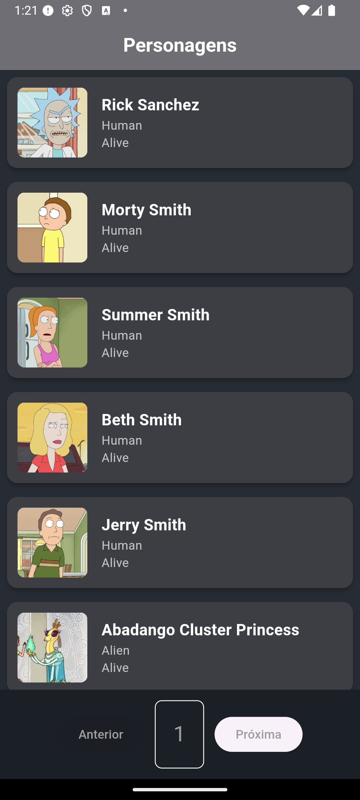

# Rick and Morty Flutter App

## Sobre o projeto

Este é um projeto simples em Flutter para consumo da API pública do Rick and Morty (https://rickandmortyapi.com/). Ele exibe uma lista paginada de personagens com informações básicas e detalhes ao clicar em cada um.

---

## Desafio Técnico

Este projeto foi desenvolvido como parte de um teste técnico para a empresa fteam. 
O objetivo é criar uma aplicação mobile Flutter que consome a API Rick and Morty para listar personagens e mostrar detalhes básicos.

---

## Funcionalidades

- **Consumo da API:** Busca dos dados da API.  
- **Listagem de Personagens:** Exibe lista com nome e imagem de cada personagem.  
- **Detalhes do Personagem:** Na tela de detalhes, mostra:  
  - Nome (`name`)  
  - Status (`status`)  
  - Espécie (`species`)

---

## Arquitetura

O projeto segue o padrão **MVVM (Model-View-ViewModel)**:

- **Model:** Classes de dados que representam os personagens e lógica pura para mapear a API.  
- **View:** Widgets Flutter que compõem a interface do usuário.  
- **ViewModel:** Camada que conecta Model e View, gerenciando o estado, realizando chamadas à API e notificando a View sobre atualizações.

---

## Estrutura do Projeto

- `models/` — Modelos de dados.  
- `viewmodels/` — Classes que gerenciam estado e lógica de negócio.  
- `views/` — Telas e widgets da interface.  
- `services/` — Serviços para comunicação com a API.

---

## Tecnologias e Ferramentas

- Flutter e Dart  
- Gerenciamento de estado com `ChangeNotifier`  
- HTTP para consumo da API Rick and Morty

---

## Critérios de Avaliação

- Código limpo, legível e organizado.  
- Uso correto da arquitetura MVVM.  
- Usabilidade e responsividade do app.  
- Aplicação de boas práticas de desenvolvimento.

---

## Como executar

1. Clone o repositório:  
```bash
git clone <URL-do-repo>
```

2. Acesse a pasta do projeto:  
```bash
cd nome-do-projeto
```

3. Instale as dependências:  
```bash
flutter pub get
```

4. Execute o app:  
```bash
flutter run
```

---